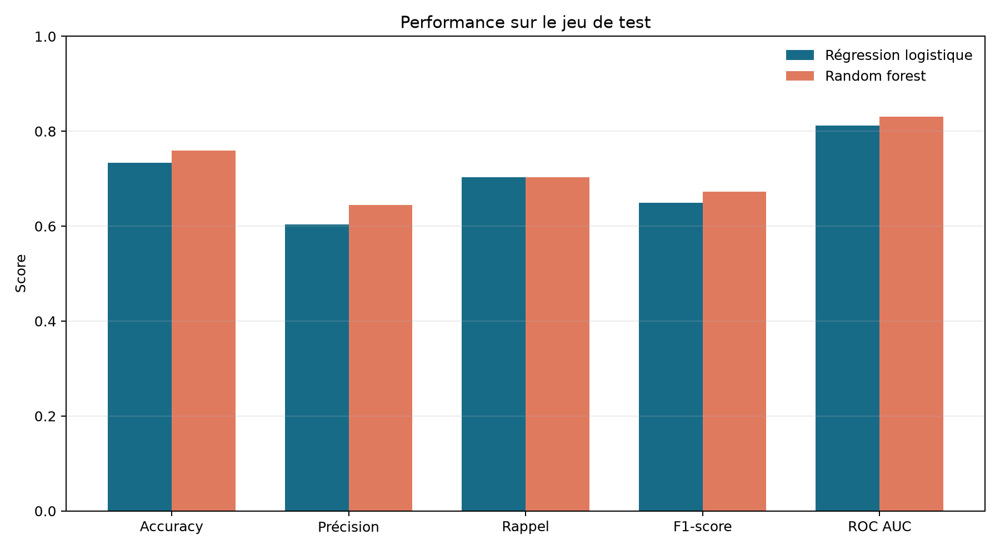
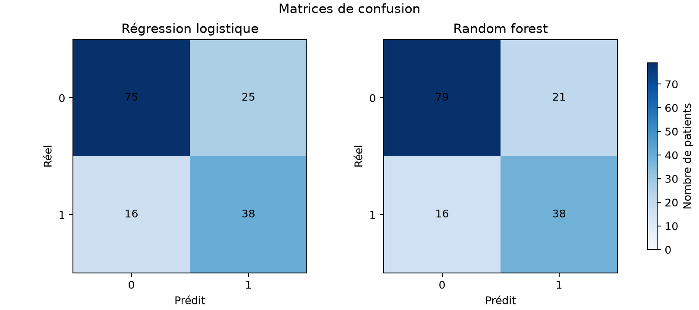
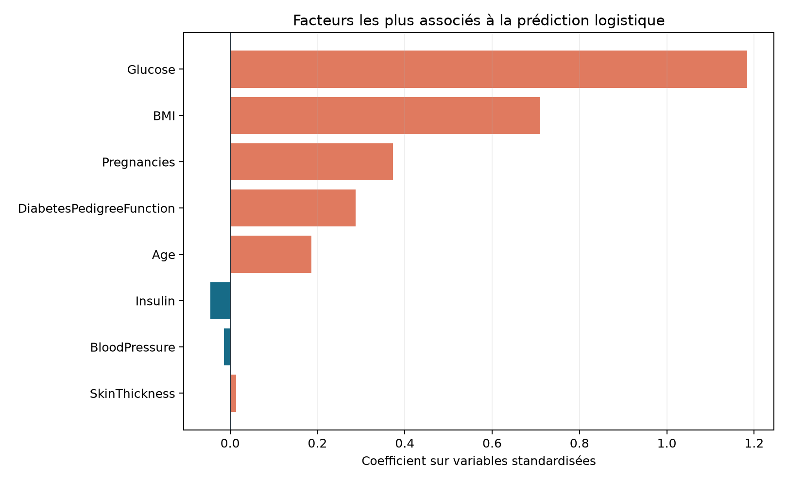

# Diabetes Risk Prediction

Pipeline Python reproductible pour estimer le risque de diabète à partir de mesures cliniques. Le projet traite les valeurs manquantes implicites du jeu **Pima Indians Diabetes**, compare deux modèles supervisés et conserve automatiquement le meilleur modèle selon le ROC AUC.

> **Important** : projet éducatif et expérimental. Les prédictions ne constituent ni un diagnostic, ni un avis médical, ni une recommandation de prise en charge. Ce modèle n'est pas validé pour un usage clinique.

## Vue d'ensemble

Le pipeline suit quatre étapes :

1. chargement et contrôle du fichier CSV ;
2. remplacement des zéros non physiologiques par des valeurs manquantes, puis imputation par médiane ;
3. comparaison d'une régression logistique et d'un `RandomForestClassifier` ;
4. sauvegarde du modèle retenu, des métriques et des figures d'évaluation.

Les statistiques d'imputation et le scaler sont appris uniquement sur le sous-ensemble d'entraînement, afin d'éviter la fuite de données.

## Résultats de référence

Évaluation obtenue avec `random_state=42` sur un jeu de test stratifié représentant 20 % des 768 observations. La classe positive correspond à `Outcome = 1`.

| Modèle | Accuracy | Précision classe 1 | Rappel classe 1 | F1 classe 1 | ROC AUC |
| --- | ---: | ---: | ---: | ---: | ---: |
| Régression logistique | 0,734 | 0,603 | 0,704 | 0,650 | 0,812 |
| **Random forest** | **0,760** | **0,644** | **0,704** | **0,673** | **0,831** |

Le random forest est donc sélectionné et enregistré dans `models/model.pkl`. Les résultats complets sont disponibles dans `outputs/metrics.json`.

### Figures générées

Ces images sont produites directement par `src/train.py` à partir de la dernière exécution du pipeline.

| Comparaison des scores | Matrices de confusion |
| --- | --- |
|  |  |



La figure des coefficients sert à interpréter le modèle linéaire. Elle ne représente pas une causalité médicale.

## Installation

Python 3.12 est recommandé.

```bash
git clone https://github.com/Adam01-i/diabetes-risk-prediction.git
cd diabetes-risk-prediction

python3 -m venv venv
source venv/bin/activate
python -m pip install -r requirements.txt
```

Sous Windows, activez l'environnement avec `venv\\Scripts\\activate`.

## Utilisation

### Entraîner et évaluer les modèles

```bash
python src/train.py --data data/diabetes.csv
```

La commande génère ou met à jour :

- `models/model.pkl` : modèle sélectionné, scaler, médianes et noms des variables ;
- `outputs/metrics.json` : rapports de classification, matrices de confusion et ROC AUC ;
- `outputs/figures/model_comparison.png` : comparaison des métriques ;
- `outputs/figures/confusion_matrices.png` : erreurs et bonnes classifications ;
- `outputs/figures/logistic_coefficients.png` : coefficients de la régression logistique.

### Prédire de nouveaux patients

Après l'entraînement :

```bash
python src/predict.py --patients data/new_patients_example.csv
```

Pour fournir un autre modèle :

```bash
python src/predict.py \
  --patients data/new_patients_example.csv \
  --model models/model.pkl
```

La sortie affiche, pour chaque ligne, la classe prédite et la probabilité estimée de `Outcome = 1`.

## Données attendues

### Jeu d'entraînement

`data/diabetes.csv` contient 768 observations et les variables suivantes :

| Variable | Description |
| --- | --- |
| `Pregnancies` | Nombre de grossesses |
| `Glucose` | Concentration de glucose |
| `BloodPressure` | Pression artérielle diastolique |
| `SkinThickness` | Épaisseur du pli cutané |
| `Insulin` | Insulinémie |
| `BMI` | Indice de masse corporelle |
| `DiabetesPedigreeFunction` | Fonction de pedigree du diabète |
| `Age` | Âge |
| `Outcome` | Cible binaire : `0` ou `1` |

### Fichier de prédiction

Un fichier passé à `--patients` doit contenir les huit variables explicatives, sans la colonne `Outcome`. L'ordre des colonnes n'est pas important.

```csv
Pregnancies,Glucose,BloodPressure,SkinThickness,Insulin,BMI,DiabetesPedigreeFunction,Age
6,148,72,35,0,33.6,0.627,50
1,85,66,29,0,26.6,0.351,31
```

## Prétraitement

Le module `src/data_prep.py` applique le même traitement à l'entraînement et à la prédiction :

- `0` est converti en valeur manquante pour `Glucose`, `BloodPressure`, `SkinThickness`, `Insulin` et `BMI` ;
- les valeurs manquantes sont imputées par la médiane du train ;
- le split train/test est stratifié ;
- le `StandardScaler` est ajusté sur le train uniquement ;
- les médianes et le scaler sont sérialisés avec le modèle sélectionné.

Cette stratégie est particulièrement importante ici : `Insulin` contient 48,7 % de zéros et `SkinThickness` 29,6 %.

## Structure du projet

```text
diabetes-risk-prediction/
├── data/
│   ├── diabetes.csv
│   └── new_patients_example.csv
├── models/
│   └── model.pkl                 # généré après entraînement
├── outputs/
│   ├── metrics.json
│   └── figures/                  # PNG générés après entraînement
├── src/
│   ├── data_prep.py
│   ├── train.py
│   └── predict.py
├── requirements.txt
├── LICENSE
└── README.md
```

## Limites et bonnes pratiques

- Le dataset est petit et issu d'une population spécifique ; la généralisation à d'autres populations n'est pas établie.
- Le résultat repose sur un seul découpage train/test et ne remplace pas une validation croisée ou externe.
- Les probabilités n'ont pas été calibrées.
- Le seuil de décision par défaut n'a pas été optimisé pour un besoin clinique donné.
- Les coefficients et probabilités sont des sorties statistiques, pas des explications médicales.
- Aucune décision médicale ne doit être automatisée à partir de ce dépôt.

## Dépendances

- Python 3
- pandas
- NumPy
- scikit-learn
- matplotlib

Les versions minimales sont définies dans [requirements.txt](requirements.txt).

## Licence

Projet distribué sous licence MIT. Voir [LICENSE](LICENSE).
